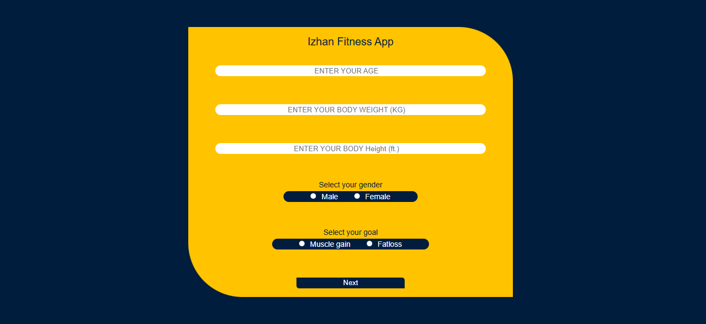
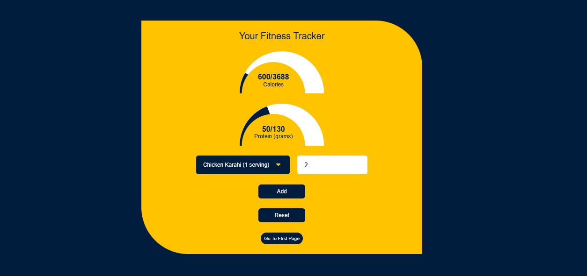

# JS-Fitness-App 💪

A simple and user-friendly fitness web application built using **HTML, CSS, and JavaScript**.
This app helps users calculate their daily **calorie and protein requirements** based on their personal details and fitness goals.

---

## 📝 Description

JS-Fitness-App allows users to input their **age, height, weight**, and select a fitness goal such as **fat loss** or **muscle gain**.
Based on this data, the app calculates and displays the recommended **daily calorie intake** and **protein requirements**.

It also includes a visually appealing list of **food options** to help users make better dietary choices.

---

## ✨ Features

* 📊 Calculates daily calorie needs
* 💪 Suggests protein intake based on goal
* 🎯 Supports goals:

  * Fat Loss
  * Muscle Gain
* 🍽️ Displays a list of food options
* 🎨 Clean, beautiful, and user-friendly UI
* ⚡ Fast and lightweight (no frameworks used)

---

## 🛠️ Technologies Used

* HTML5
* CSS3
* JavaScript (Vanilla JS)

---

## 🚀 Installation

1. Clone the repository:

   ```bash
   git clone https://github.com/izhanwk/JS-Fitness-App
   ```
   
2. Open `index.html` in your browser.

---

## ▶️ Usage

1. Enter your:

   * Age
   * Height
   * Weight

2. Select your goal:

   * Fat Loss
   * Muscle Gain

3. View your:

   * Daily calorie requirement
   * Protein intake recommendation
   * Calorie and Protein tracking

4. Explore suggested food options.

---

## 📸 Screenshots




---

## 🤝 Contributing

Contributions are welcome!
Feel free to fork this repository and submit a pull request.

---

## 🌏 Live Link
   ```bash
   https://izhanwk.github.io/JS-Fitness-App
```
---

## 📄 License

This project is open-source and available under the MIT License.

---

## 🙌 Acknowledgements

This project was created as a beginner-friendly fitness calculator to practice JavaScript and web development fundamentals.
